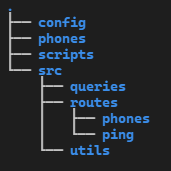
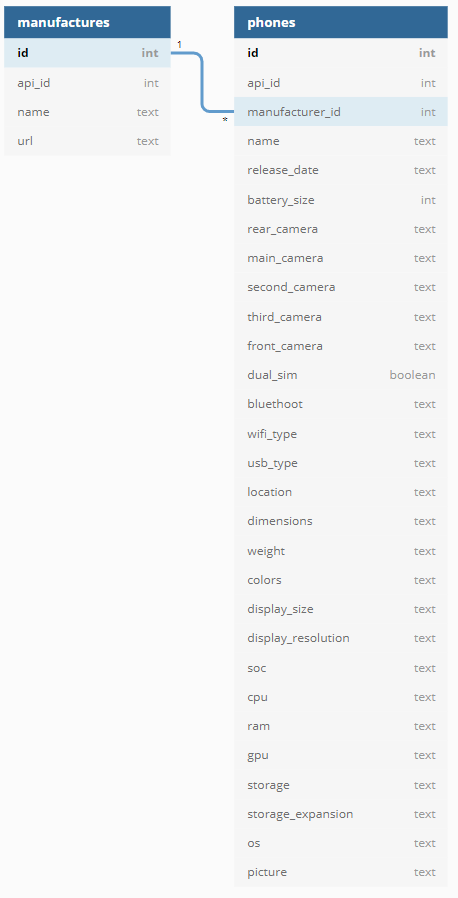

## Intro

In this document I will try to explain the technical challenge details with all the endpoints created and how they work. This README file is for the API of the React code challenge

## 1. Configure

The first thing that needs to be done is configure the `.env` and `.env.docker` files in order to work with environment variables. For this, I set up a `.env.dist` and `.env.docker.dist` files where you can see which variables need to be created. There are the following ones:

1. For `.env`:

- GRAB_A_PHONE_API_KEY: This won't be necessary to configure, as this was created in order to download phone information from the API in [http://grabaphone.herokuapp.com/](http://grabaphone.herokuapp.com/).
- SLONIK_URL: This key needs to be set up in order to connect to the PostgreSQL DB where the phone data will be stored. The credentials for this (user, password, db name, port) can be found in the docker compose env file, which you should configure in order to be secure.

2. For `.env.docker`:

- DB_USER: The user the DB will use to connect.
- DB_PASSWORD: The password for the user.
- DB: The name for the database the project will use.

After this first set up, you can run the `build.sh` script in order to launch the build of the project. This script will create the docker container with the DB, start and populate it with the data gathered from the aforementioned API (the way I gathered the date will be explained a bit down in the documentation).

Here is the in depth explanation of the `build.sh` script:

1. Docker compose: This will use the `docker-compose.yaml` file in order to create 2 containers: one with the PostgreSQL DB using the default 5432 port and the other one with and Adminer management tool in order to interact with the DB (if necessary) on port 8080. In order to avoid authentication issues, ensure you have the `.env.docker` file properly configured.
2. Run `npm i` to install all necessary dependencies.
3. Data seeds: This is launched using `npm run db:up` command, which will trigger the DB tables creation and will insert the phones data into the correspondent table.

Then, you should run `npm run start` script which will start the server and the API. If you prefer to launch the server in development mode you can do this by running `npm run dev` command.

If everything goes as expected, you should be able to start using the endpoints.

## 2. Gather phones data

When I first thought about how to get the data in order to have it seeded in the DB at start I came up with two options:

1. Create the data manually myself, with only some minimal information of the phones.
2. Create the data programmatically using any kind of API or data on the web.

As this is a technical test, I opted for the second one! For this, I searched online and I found [http://grabaphone.herokuapp.com/](http://grabaphone.herokuapp.com/), which is a phone DB with an API you can easily use. In order to work with this API, I first called the endpoint to get all the manufactureres and then I created the file `getPhonesByManufacturer.js`, which connects to the API and uses those manufacturers to gather each manufacturer phones and store them in the `/phones` folder, each of them in a `.json` file.

This data is the one used to populate the DB.

Please, bear in mind, as this data was not controlled by me, there will be some other devices as smartwatches and tablets on top of phones, with more than 3000 items!

## 3. Project structure and libraries used



As you can see in the previous image, I've used a rather simple structure which I'll explain next:

- Inside the `scripts` folder you will find every script used to either gather the data (`getPhonesByManufacturer.js`) or to interact with the DB (create the tables - `creations.js`, insert data - `insertions.js` - or drop the tables - `drops.js`).
- Inside the `phones` folder there are the files containing the phones by manufacturer that will go into the DB.
- In the `config` folder you will find the DB configuration.
- The `src` folder contains the app itself. It's divided as follows:
  - Root of the folder contains `app.js` which is used to configure the Express application and `index.js` in order to import that app and launch it.
  - In `queries` folder you can find `phones.js` file which contains all the raw SQL queries to the DB.
  - In the `utils` folder there is a file which conatins a function to calculate the necessary offset por paginated endpoints.
  - Lastly, the `routes` folder contains the actual routes of the app, having an `index.js` which gathers all the routes and exports them to be used in the app configuration. Inside each folder you will find a folder with the name of the parent endpoint and inside each a new `index.js` and a file for each endpoint (i.e.: `/phones` folder contains all the phones endpoints).

Regarding libraries, I have used:

- Express in order to create the server.
- Dotenv so I could use the environment variables.
- Morgan as a logger.
- Axios for the `getPhonesByManufacturer.js` script, so I could fetch data from the GRAB A PHONE API.
- Slonik to work with the PostgreSQL DB.
- Cors to work with the frontend in order to avoid CORS issues.
- Nodemon as dev-dependency to work with the server so it restarts every time I saved changes.

All this information can be seen in the `package.json` file.

## 4. DB architecture



As can be seen in the above image, the architecture of the DB is the following:

- For manufacturers I kept all the API fields and I included an ID in order to have a primary key.
- For phones, instead of using the manufacturer name I used a reference to its ID in the manufacturer table and then I created different columns with data I thought could be relevant to show in the application, although I may mentioned I didn't show all in the end.

## 5. Stop and remove environment

When finished, in order to remove the data from the DB and the Docker containers used in the demo, you just need to run the `stop.sh` script, which will trigger the following:

1. Data drop: Using the `npm run db:drop` which will use the `drops.js` script in order to drop all the tables in the DB.
2. Docker removal: Using the `npm run docker:down` command, which will remove all the containers used running the `docker-compose down` command.
3. Node modules removal: `rm -rf node_modules` in order to remove node_modules folder.

## 6. Endpoints

I've configured a postman json file named `DCSLGuidesmiths.postman_collection.json` in case you want to import the collection to postman, which will make easier to have all endpoints configured as expected. Even though, I will explain all the endpoints next.

All the endpoints URLs start with `{{HOST}}:{{PORT}}/api/`, being `HOST` and `PORT` two variables set up in the collection with values as `http://localthost` and `4000`.

First of all, before explainig all the endpoints, just mentioned there is an error control in place, so if an endpoint is not found, will return a 404 error as follows:

```json
{
  "success": false,
  "info": {
    "message": "path not found",
    "code": 404
  }
}
```

And if there is any other errors, it will return the same with the correspondent error code and message, for instance:

```json
{
  "success": false,
  "info": {
    "message": "server error",
    "code": 500
  }
}
```

### GET /ping

This endpoint has the only purpose to test the server, and will return the following response if ok:

```json
{
  "success": true,
  "data": "pong"
}
```

### GET /phones?limit=<num>&page=<num>

Endpoint that will return the data of all the phones in the DB, paginated with 30 books at a time, which can be configured changing the `limit` query param. If no `page` param is used, it defaults to 1, returning the first page. It returns the next page among the data or `null` if there is no next page, as follows:

```json
{
  "success": true,
  "count": 30,
  "nextPage": 13,
  "data": [
    {
      "id": 321,
      "api_id": 15,
      "manufacturer_id": 1,
      "name": "Apple iPad 2 Wi-Fi",
      "release_date": "Mar 02, 2011",
      "battery_size": 6944,
      "rear_camera": "Single camera",
      "main_camera": "0.7 MP",
      "second_camera": null,
      "third_camera": null,
      "front_camera": "0.3 MP VGA",
      "dual_sim": false,
      "bluetooth": null,
      "wifi_type": "802.11 a, b, g, n",
      "usb_type": "Proprietary",
      "location": null,
      "dimensions": "9.50 x 7.31 x 0.34 inches (241.2 x 185.7 x 8.8 mm)",
      "weight": "21.20 oz (601.0 g)",
      "colors": "Black, White",
      "display_size": 9.7,
      "display_resolution": "768 x 1024 pixels, 132 PPI",
      "display_type": "IPS LCD",
      "soc": "Apple A5 S5L8940X",
      "cpu": "Dual-core, 1000 MHz, ARM Cortex-A9, 45 nm",
      "gpu": "PowerVR SGX543MP2",
      "ram": "0.5GB DDR2",
      "storage": "64GB",
      "storage_expansion": null,
      "os": "iOS (8.x, 7.x, 6.1, 6.x, 5.1, 5, 4.x)",
      "picture": "https://m-cdn.phonearena.com/images/phones/27197-350/Apple-iPad-2-Wi-Fi.jpg"
    },
    {...},
  ]
}
```

### GET /phones/:phoneId

Retrieves the information of a single phone when passing a phone ID as parameter:

```json
{
  "success": true,
  "count": 1,
  "data": [
    {
      "id": 2,
      "api_id": 3058,
      "manufacturer_id": 61,
      "name": "ARCHOS 50 Titanium",
      "release_date": null,
      "battery_size": 2100,
      "rear_camera": "Single camera",
      "main_camera": "5 MP (Autofocus)",
      "second_camera": null,
      "third_camera": null,
      "front_camera": "0.3 MP VGA",
      "dual_sim": true,
      "bluetooth": null,
      "wifi_type": "Yes; Hotspot",
      "usb_type": "microUSB, USB 2.0",
      "location": "GPS, A-GPS",
      "dimensions": "5.69 x 2.90 x 0.39 inches (144.5 x 73.7 x 9.9 mm)",
      "weight": "5.64 oz (160.0 g)",
      "colors": null,
      "display_size": 5,
      "display_resolution": "960 x 540 pixels, 220 PPI",
      "display_type": "IPS LCD",
      "soc": "MediaTek MT6572",
      "cpu": "Dual-core, 1300 MHz, ARM Cortex-A7",
      "gpu": "Mali-400",
      "ram": "0.5GB",
      "storage": null,
      "storage_expansion": "microSDHC",
      "os": "Android (4.2.2)",
      "picture": "https://m-cdn.phonearena.com/images/phones/43357-350/ARCHOS-50-Titanium.jpg"
    }
  ]
}
```

### POST /phones/add/

This endpoint will allowto create a new phone, and will return its information once created. If no information is added to a field, it will created as `null` in the DB. If creates the phone, the endpoint will return a `201` code, which means a new entity has been created and the phone information:

```json
{
  "success": true,
  "count": 1,
  "data": [
    {
      "id": 3084,
      "api_id": null,
      "manufacturer_id": 1,
      "name": "Test Phone",
      "release_date": null,
      "battery_size": 4000,
      "rear_camera": null,
      "main_camera": null,
      "second_camera": null,
      "third_camera": null,
      "front_camera": null,
      "dual_sim": false,
      "bluetooth": null,
      "wifi_type": null,
      "usb_type": "Type C",
      "location": null,
      "dimensions": "whatever",
      "weight": "200 g",
      "colors": null,
      "display_size": 5,
      "display_resolution": null,
      "display_type": "AMOLED",
      "soc": "Test SOC",
      "cpu": "Test CPU",
      "gpu": "Test GPU",
      "ram": "Test RAM",
      "storage": "16 GB",
      "storage_expansion": null,
      "os": "Test OS",
      "picture": null
    }
  ]
}
```

To pass the phone info to the endpoint, you will need to use a body in JSON format as follows.

```json
{
  "name": "Test Phone",
  "manufacturer": "Apple",
  "soc": "Test SOC",
  "cpu": "Test CPU",
  "ram": "Test RAM",
  "gpu": "Test GPU",
  "display_size": 5.0,
  "display_type": "AMOLED",
  "os": "Test OS",
  "storage": "16 GB",
  "usb_type": "Type C",
  "weight": "200 g",
  "dimensions": "whatever",
  "main_camera": "two cameras",
  "battery_size": 4000
}
```

Bear in mind, if you send a manufacturer name that does not exist in the DB, it will create it in order to use its ID in the correspondent column.

Also, if the manufacturer name or the phone model is not in the body, an error will be thrown:

```json
{
  "success": false,
  "info": {
    "message": "unable to add phone without manufacturer and name",
    "code": 400
  }
}
```

### PATCH /phones/edit/:phoneId

This endpoint will edit a phone using its phone ID. As I had some issues working with undefined fields in slonik in the UPDATE query, I kept all the fileds as necessary except the picture (as there is a fallback picture in place in the front end), so if you don't pass one of them, you will receive the follow error message:

```json
{
  "success": false,
  "info": {
    "message": "all fields are mandatory",
    "code": 400
  }
}
```

If everything goes fine and the phone gets updated, the response will be the phone information as follows:

```json
{
  "success": true,
  "count": 1,
  "data": [
    {
      "id": 3083,
      "api_id": null,
      "manufacturer_id": 8,
      "name": "Test Phone",
      "release_date": null,
      "battery_size": 4000,
      "rear_camera": "two cameras",
      "main_camera": null,
      "second_camera": null,
      "third_camera": null,
      "front_camera": null,
      "dual_sim": false,
      "bluetooth": null,
      "wifi_type": null,
      "usb_type": "Type C",
      "location": null,
      "dimensions": "whatever",
      "weight": "200 g",
      "colors": null,
      "display_size": 5,
      "display_resolution": null,
      "display_type": "AMOLED",
      "soc": "Test SOC",
      "cpu": "Test CPU",
      "gpu": "Test GPU",
      "ram": "Test RAM",
      "storage": "16 GB",
      "storage_expansion": null,
      "os": "Test OS",
      "picture": null
    }
  ]
}
```

### DELETE /phones/delete/:phoneId

This endpoint will receive the `phoneId` of the phone as a parameter and will use it in order to remove it from the DB. If ok, the response will be empty with a `204` code, which means there is no content to return as it has been removed.
